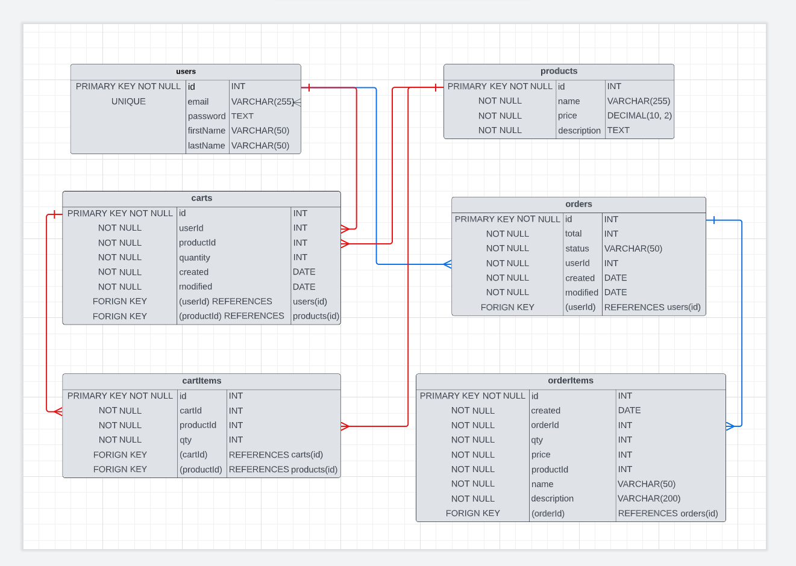

# README E-Commerce App

## How to Run the E-Commerce App

Clone the repository to your local machine using git clone command.
Run npm install in the terminal to install all the required dependencies.
Create a .env file in the root directory and set the following environment variables:
DATABASE_URL: the URL for your Postgres database
JWT_SECRET: the secret key for JSON Web Token
Run npm run db:init to initialize the database with seed data.
Run npm run dev to start the server.
Open http://localhost:3000/api-docs in your browser to view the Swagger documentation for the API.

## Wireframe

 

## Endpoints

- POST /auth/register: Register a new user.
- POST /auth/login: Log in an existing user and get a JWT token.
- GET /products: Get all products.
- GET /products/:id: Get a product by ID.
- POST /products: Add a new product.
- PUT /products/:id: Update a product by ID.
- DELETE /products/:id: Delete a product by ID.
- GET /users: Get all users.
- GET /users/:id: Get a user by ID.
- PUT /users/:id: Update a user by ID.
- DELETE /users/:id: Delete a user by ID.
- GET /users/:id/cart: Get a user's cart by ID.
- POST /users/:id/cart: Add a product to a user's cart by ID.
- PUT /users/:id/cart/:productId: Update a product in a user's cart by ID and product ID.
- DELETE /users/:id/cart/:productId: Delete a product from a user's cart by ID and product ID.
- POST /users/:id/orders: Place an order for a user by ID.
- GET /users/:id/orders: Get all orders for a user by ID.
- GET /orders: Get all orders.
- GET /orders/:id: Get an order by ID.
- PUT /orders/:id: Update an order by ID.
- DELETE /orders/:id: Delete an order by ID.

### Dependencies

- express: web framework for Node.js
- pg: PostgreSQL client for Node.js
- jsonwebtoken: implementation of JSON Web Tokens
- bcrypt: password hashing library
- swagger-ui-express: middleware for serving Swagger UI
- swagger-jsdoc: library for generating Swagger documentation from JSDoc comments
- dotenv: library for loading environment variables from a .env file
- nodemon: tool for automatically restarting the server when changes are made to the code

## Contributing

If you would like to contribute to the project, please fork the repository and submit a pull request with your changes. Please make sure your changes are well-documented and tested before submitting the pull request.

## Licence

This project is licensed under the MIT License. See the LICENSE file for details

